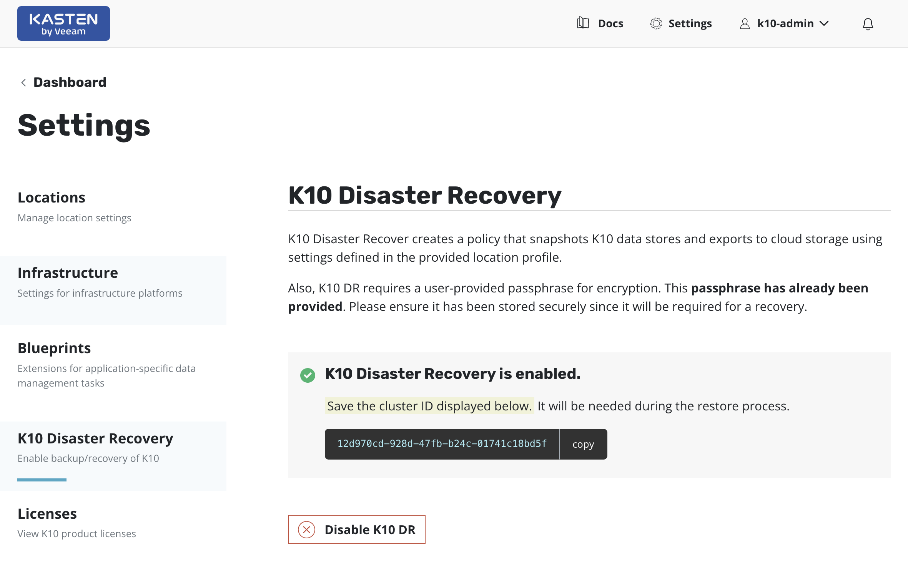

***Status:** Work-in-progress. Please create issues or pull requests if you have ideas for improvement.*

# **Kasten K10 full automated Disaster Recovery with Ansible**
Example of using the Kasten K10 Disaster Recovery feature with Terraform and Ansible to automate the Disaster Recovery Plan for Kubernetes workloads.

## Summary
This projects demostrates the process of recovering a Kasten K10 instance and all the protected Kubernetes workloads (applications) after a disaster ocurrs on Kubernetes cluster.  

All the automation is done using Terraform, Ansible playbooks, and leveraging the [Kasten K10 API](https://docs.kasten.io/latest/api/cli.html).

## Disclaimer
This project is an example of an deployment and meant to be used for testing and learning purposes only. Do not use in production. 

# Table of Contents

1. [Getting started](#Getting-started)
2. [Prerequisites](#Prerequisites)
3. [Recovering K10 and all Kubernetes Applications From a Disaster](#Recovering-K10-and-all-Kubernetes-Applications-From-a-Disaster)
4. [Parameters](#Parameters)
5. [Recovery duration](#Recovery-duration)
6. [File structure and deployment workflow](#File-structure-and-deployment-workflow)

# Getting started

K10 Disaster Recovery (DR) aims to protect K10 from the underlying infrastructure failures. In particular, this feature provides the ability to recover the K10 platform in case of a variety of disasters such as the accidental deletion of K10, failure of underlying storage that K10 uses for its catalog, or even the accidental destruction of the Kubernetes cluster on which K10 is deployed.

K10 enables Disaster Recovery with the help of an internal policy to backup its own data stores and store these in an object storage bucket or an NFS file storage location configured using a Location Profile.

## Prerequisites

To run this project you need to have some software installed and configured: 

1. The Production Kubernetes cluster (cluster to be recovered) must have been using [Kasten K10](https://docs.kasten.io/latest/install/index.html) to backup all applications and cluster-wide resources.
	- Kasten K10 Disaster Recovery must have been enabled in the Production cluster.
	- A [Location Profile](https://docs.kasten.io/latest/usage/configuration.html) must be provided to store the Kasten configuration backups.
	- During the enabling process it's necessary to provide a passphrase for encrypting the snapshot data. The passphrase can be provided directly or provided from a HashiCorp Vault instance if K10 is configured to access Vault.   This passphrase **will be required** afterward to restore the Kasten configuration.
	- Once K10 Disaster Recovery is enabled, a  confirmation message with the cluster ID will be displayed when Disaster Recovery is enabled. Save the cluster ID safely, **it is required to recover K10 from a disaster**.
1. Kasten K10 Disaster Recovery Policy and all Policies protecting Kubernetes applications must have been run at least once to provide the required restore points for this project.

	
	
**IMPORTANT**: After enabling K10 Disaster Recovery, it is essential that you copy and save the following to successfully recover K10 from a disaster:
1. The cluster ID displayed on the disaster recovery page
1. The Disaster Recovery passphrase provided above
1. The credentials and object storage bucket or the NFS file storage information (used in the Location Profile configuration above)

Without this information, K10 Disaster Recovery will not be possible.

# Overview of the Disaster Recovery strategy
Recovering a Kasten K10 instance from a K10 backup involves the following sequence of actions:

1. Deploy a new Kubernetes Cluster and install a fresh K10 instance
1. Create a Kubernetes Secret, k10-dr-secret, using the passphrase provided while enabling Disaster Recovery.
1. Provide bucket information and credentials for the object storage location where previous K10 backups are stored
1. Restoring the K10 backup
1. Restoring the cluster-wide resources from backups
1. Restoring the applications from backups

All these steps will be automated using the Terraform manifests and Ansible playbooks provided in this project.

## Deploying a Kubernetes Cluster and Installing Kasten using Terraform
For this project, we will be using Terraform for deploying a Kubernetes cluster and Kasten, including initial Kasten configuration.  The purpose is to automate the deployment of a Kubernetes Cluster for DR purposes.

The resources to be created are the following:
* Cloud network Resources
* AKS/EKS/GKE Cluster
    - Volume Snapshot Class
	- Any other Kubernetes component required for Kasten
* Object Storage (AWS S3 / Azure Blob / Google Storage Account)
* Kasten
    - Token Authentication
    - Access via LoadBalancer
    - EULA agreement
    - Location Profile creation using Object Storage
    - Policy preset samples creation

I'm providing the Terraform manifests for the following options:
* [AWS Elastic Kubernetes Service (EKS)](./Terraform-awseks-kasten/README.md)
* [Google Cloud Kubernetes Engine (GKE)](./Terraform-gcgke-kasten/README.md)
* [Azure Kubernetes Service (AKS)](./Terraform-azureaks-kasten/README.md)

Using this Terraform manifests it is possible to deploy a new Kubernetes Cluster and deploy Kasten with the initial configuration.

## Restoring Kasten K10 Configuration and Applications
For this project we will be using Ansible playbooks to automate the recovery of Kasten K10 configuration and all the Applications with available backups, all of this in a new Kubernetes Cluster created for DR purposes.

### Recovery duration

The entire recovery process will take approx 10 minutes or more depending on the number of applications and data to recover. 

### File structure and deployment workflow

The Deployment consists of two main playbook triggering multible tasks:
**NOTE**: Here is important to choose the playbook according to the type of bucket used to keep the Kasten Configuration Backup.  For instance, if your cluster is using an AWS S3 Bucket to keep the Kasten DR Configuration backup, then you need to use the "01_k10_dr_awss3_restore.yaml" playbook, as this will re-create the Location Profile with the same AWS S3 Bucket, so then you can continue with the Kasten K10 Configuration restoring process.

1. 01_k10_dr_{type-of-bucket}_restore.yaml:
	- This playbook creates the  Kubernetes Secret "k10-dr-secret" using the passphrase provided while enabling Disaster Recovery
	- Then, this playbook creates a Location Profile using the provided Object Storage, which of course MUST contain the Kasten configuration backup (this is the Location Profile used when enabling the Kasten K10 Disaster Recovery in the Production Kubernetes cluster).  
	- Finally this playbook restores the Kasten K10 configuration from the Location Profile created.
1. 02_k10_restoreapps.yaml: 
	- This playbook look for the most recent restore points available to restore the cluster-wide resources and each application.
	- Then the playbook restore the cluster-wide resources from the most recent restore point found in previous step.
	- Next the playbook creates a namespace for every application to be restored.
	- Finally the playbook restore every application from the most recent restore point found in previous step.

All these playbooks are available in the [Ansible-kasten-dr](Ansible-kasten-dr/) folder

**Important**: The playbooks must be run in the mentioned order in order to make the recovery process works.

